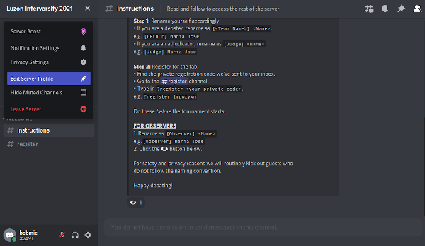

# How to Fully Access the LIV Discord Server

### Step 1: Click the link and accept the invite

Clicking "Accept Invite" will redirect you to the server page.

### Step 2: Rename yourself appropriately

To rename yourself, click on the top left dropdown that says "Luzon Intervarsity 2021", then click on "Edit Server Profile".

If you are a debater, rename as `[<Team Name>] <Tab Name>`.

If you are a judge, rename as `[Judge] <Tab Name>`.

### Step 3: Validate using your private code

Your private code is in the email where you found the link to this briefing. This is a string of eight characters that is unique to each participant. **_Do not share this with anyone._**

The final step is to use this code to validate your Discord account.
Head to the #register channel and enter in `?register <your private code>`.

