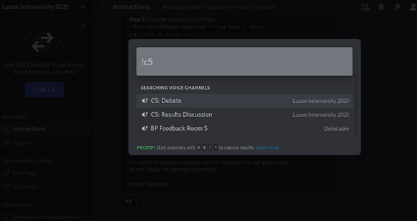

# Find a Specific User or Channel

Instead of manually scrolling through an endless list of channels and users you can press `Ctrl+K` or `⌘+K` to open a search window. Then you can type in the specific channel name you'd like to go to, or the account you need to DM. If you're looking for a voice channel use `!` as a prefix instead of `#`.

