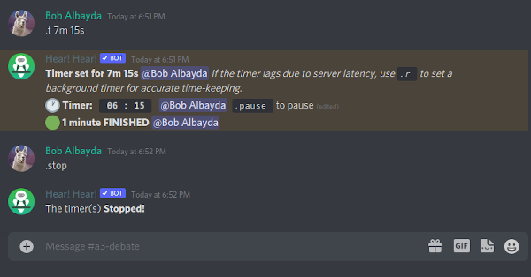

# Time with the Hear Hear! Bot

The Hear Hear! Bot allows participants to time speeches.

To start a timer, enter

`.t Xm Ys`

where `X` is the number of minutes and `Y` is the number of seconds.

Typically you'd use `.t 7m 15s` or `.t 7m` for a seven-minute debate speech. To pause the timer, enter `.pause`. You can resume where you left off with `.resume`. To stop the timer completely use `.stop`.

