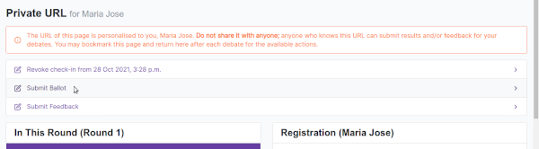
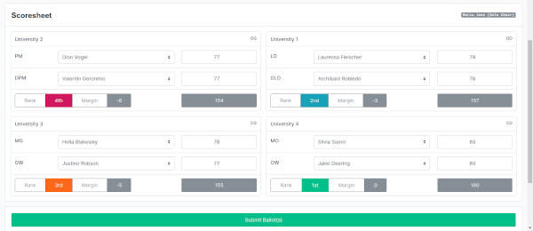
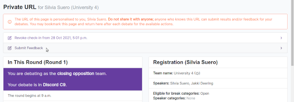
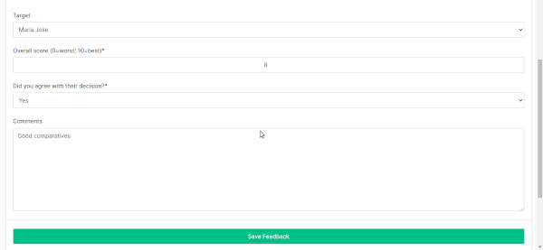

# Ballots and Feedback

### Ballots

A ballot details the names of the debaters in a room and what their positions were, what their scores were, and the team rankings. Only the chair should submit a ballot.

We emphasize that chairs submit their ballots **_before they give their oral adjudication speech_** so that the tournament doesn't get delayed.

To submit a ballot as the chair, go to your private URL and click "Submit Ballot".

Then fill up the scoresheet accurately using our speaker score scale.

### Feedback

A feedback form is used to evaluate judges. Teams and panelists submit feedback for their chair, while the chair submits feedback for their panelists and trainees. Trainees do not get to submit feedback, but may message AdjCore if they have concerns about their chair.

To submit feedback, go to your private URL and click "Submit Feedback".

Then fill up the feedback form using our judge score scale.

