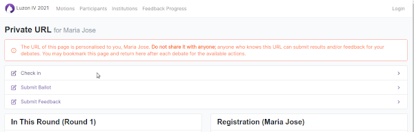
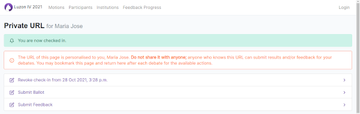

# Check-ins

Participants are expected to check in during the check-in period before each round or else risk not being allocated.

To check in, simply go to your private URL and click "Check In".

